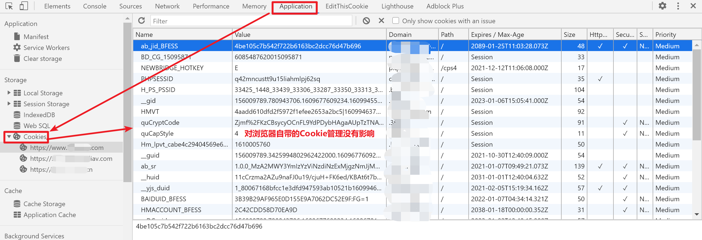
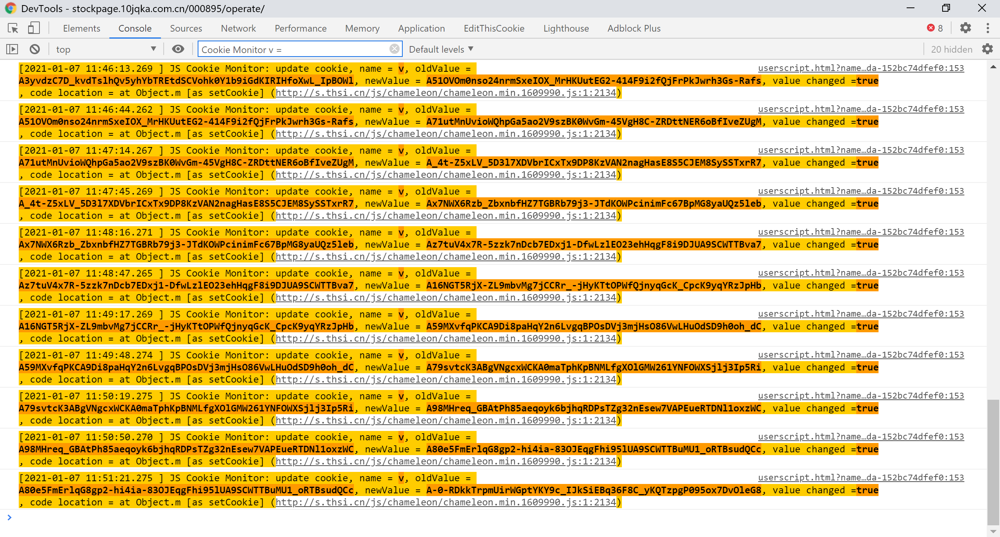
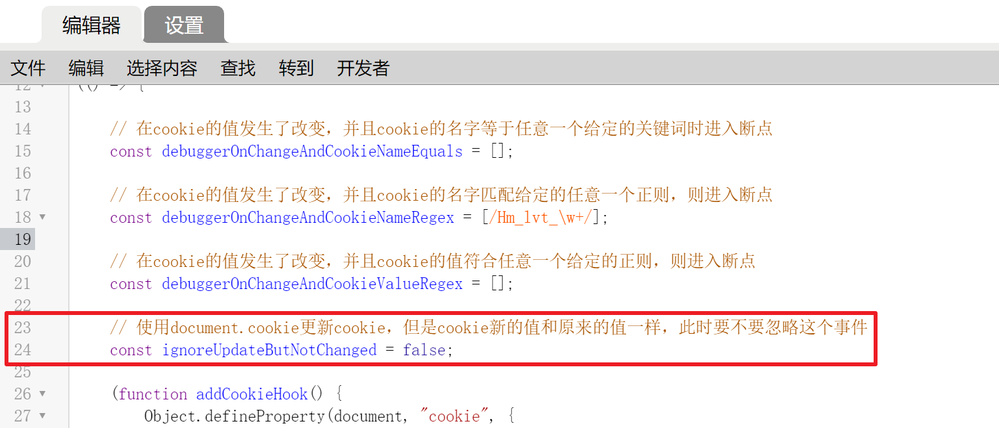
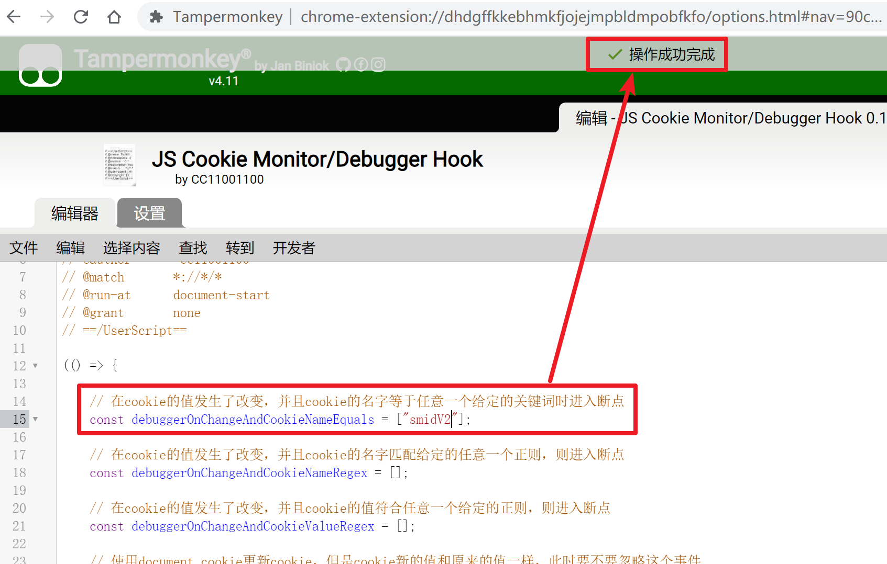
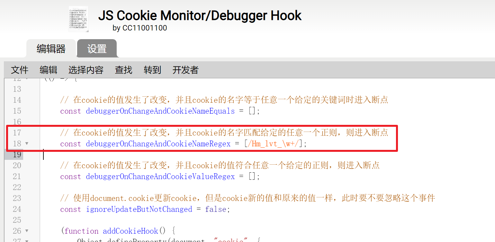
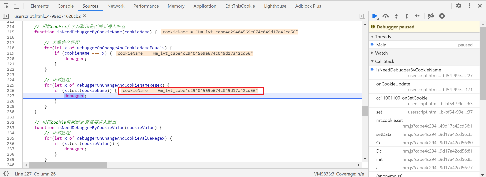

# 监控、定位JavaScript操作cookie

## 一、脚本说明
脚本定位：
- 本脚本属于JS逆向辅助工具 

Hook生效的条件：
- 需要油猴脚本被成功注入到页面中，脚本都未注入成功自然无法Hook 
- 需要是JavaScript操作document.cookie赋值来操作Cookie才能够Hook到
  （目前还没碰到不是这么赋值的...）

本脚本的功能分为两部分：
- monitor： 监控所有JS操作cookie的动作并打印在控制台上
- debugger: 在cookie符合给定条件并且发生变化时进入断点 

## 二、有何优势？

## 2.1 不影响浏览器自带的Cookie管理 
目前很多Hook脚本Hook姿势并不对，本脚本采用的是一次性、反复Hook，对浏览器自带的Cookie管理无影响：

## 2.2 功能更强 
除了cookie断点功能之外，增加了Cookie修改监控功能，能够在更宏观的角度分析页面上的Cookie：

（算了，放弃打码了...）

颜色是用于区分操作类型：
- 绿色是添加Cookie 
- 红色是删除Cookie
- 黄色是修改已经存在的Cookie的值 

每个操作都会跟着一个code location，单击可以定位到做了此操作的JS代码的位置。 

## 三、 安装
### 3.1 安装油猴插件
理论上只要脚本能够注入到页面上即可，这里采用的是油猴来将JS代码注入到页面上。     

油猴脚本可从Chrome商店安装：  
[https://chrome.google.com/webstore/detail/tampermonkey/dhdgffkkebhmkfjojejmpbldmpobfkfo](https://chrome.google.com/webstore/detail/tampermonkey/dhdgffkkebhmkfjojejmpbldmpobfkfo)

如果无法翻墙，可以在百度搜索“Tampermonkey”字样寻找第三方网站下载，但请注意不要安装了虚假的恶意插件，推荐从官方商店安装。 

### 3.2 安装本脚本 
安装油猴脚本可以从官方商店，也可以拷贝代码自己在本地创建。 
#### 3.2.1 从油猴商店安装本脚本
推荐此方式，从商店安装的脚本有后续版本更新时能够自动更新，本脚本已经在油猴商店上架： 

[https://greasyfork.org/zh-CN/scripts/419781-js-cookie-monitor-debugger-hook](https://greasyfork.org/zh-CN/scripts/419781-js-cookie-monitor-debugger-hook)
### 3.2.2 手动创建插件
如果您觉得自动更新太烦，或者有其它的顾虑，可以在这里复制代码：

[https://github.com/CC11001100/crawler-js-hook-framework-public/blob/master/001-cookie-hook/js-cookie-monitor-debugger-hook.js](https://github.com/CC11001100/crawler-js-hook-framework-public/blob/master/001-cookie-hook/js-cookie-monitor-debugger-hook.js)

review确认没问题之后在油猴的管理面板添加即可。

## 四、监控Cookie的变化

注意，监控是为了在宏观上有一个全局的认识，并不是为了定位细节
（通常情况下正确的使用工具才能提高效率哇，当然欢迎大家反馈更有意思的玩法），
比如打开一个页面时：

根据这张图，我们就能够读这个网站上哪些cookie是JS操作的，什么时间如何操作的有个大致的了解。 

再比如借助monitor观察cookie的变化规律，比如这个页面，根据时间能够看出这个cookie每个半分钟会被改变一次： 

有时候目标网站可能会反复设置一个cookie，还都是同样的值，这个变量用于忽略此类事件： 

一般保持默认即可。 

## 五、 定位Cookie的变化
注意：
- 本文中说cookie发生了变化，变化包括添加、删除、更新。 
- 过滤条件都是配置在数组中的，所有的关系之间是或的关系，也就是命中任意一个都会触发断点。

### Cookie名字完全等于给定的名字 
通常情况下我们是会先确定哪些cookie是必须的，比如`foo=bar`是必须的，
然后我们会通过搜索`set-cookie: foo`或者在console上看monitor打印的名称并通过console的filter来过滤：

然后我们想在这个cookie的值发生变化时进入断点，在油猴里打开这个脚本，
然后在`debuggerOnChangeAndCookieNameEquals`这个数组中添加cookie的名字， 记得一定要保存： 

因为油猴是在页面加载时将JS注入到页面中的，所以保存完要刷新页面，然后就自动进入断点了：

调用栈那里红色方框内是本脚本的调用栈忽略即可，有很明显的`userscript.html`特征，
忽略这些再往前，就是真正有用的代码了！ 
本脚本只能帮你做到这里，后面的征程靠你自己探索啦！

### Cookie名字符合给定的正则  
当cookie的名字里包含时间戳或者每次都变化的部分，
用cookie名称完全相等来做匹配已经不行了，这时候可以用正则，
比如百度统计跟踪的cookie `Hm_lvt_cabe4c29404569e674c049d17a42cd56`
在脚本的`debuggerOnChangeAndCookieNameRegex`中配置正则：

然后刷新页面则进入断点：

当配置了多个的时候可以根据debugger时显示的变量的值来确定进入的到底是哪一个cookie。

### Cookie的值符合给定的正则
此方法适合cookie的值比较有特征的情况下使用，配置在`debuggerOnChangeAndCookieValueRegex`中，
用法与上一个类似也是正则，此处不再举例子。

最后总结一下，三种在cookie的值发生变化时进入断点的方式：
- debuggerOnChangeAndCookieNameEquals：cookie的名称完全相等于给定的任意一个名称 
- debuggerOnChangeAndCookieNameRegex： cookie的名字符合给定的任意一个正则 
- debuggerOnChangeAndCookieValueRegex： cookie的值符合给定的任意一个正则

## 六、 问题反馈 
在使用的过程过程中遇到任何问题，可以在GitHub的`Issues`中反馈，
也可以在油猴脚本的评论区反馈，还可以给我发邮件，我看到之后会尽快处理。 

